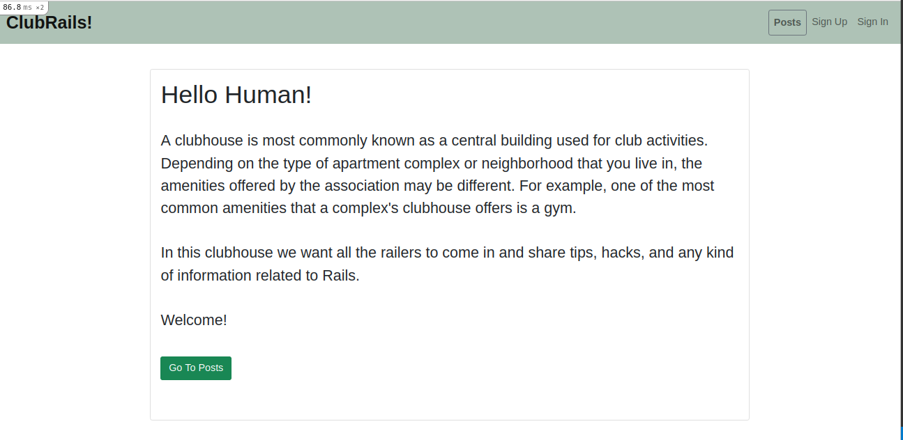
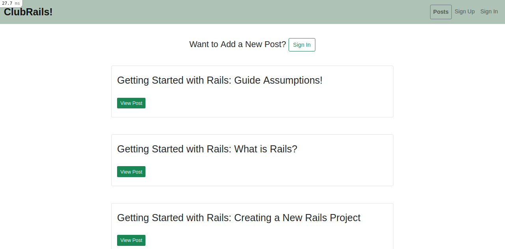
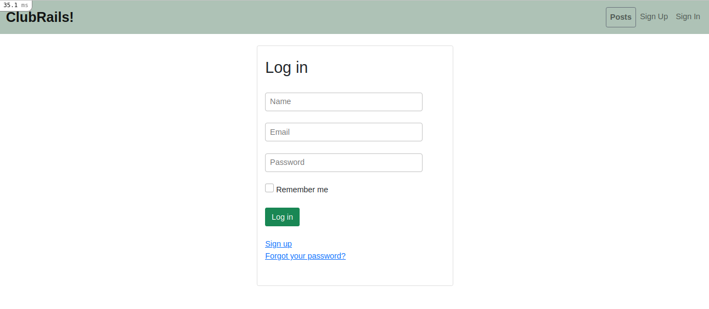
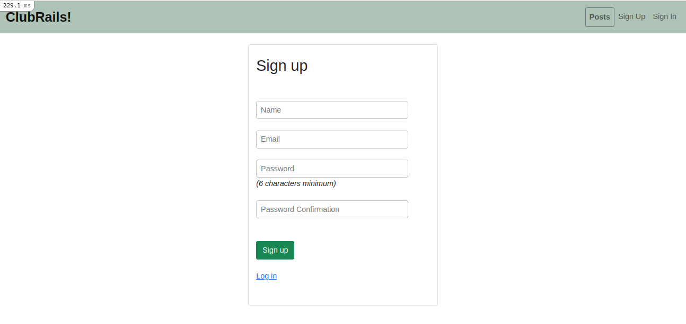
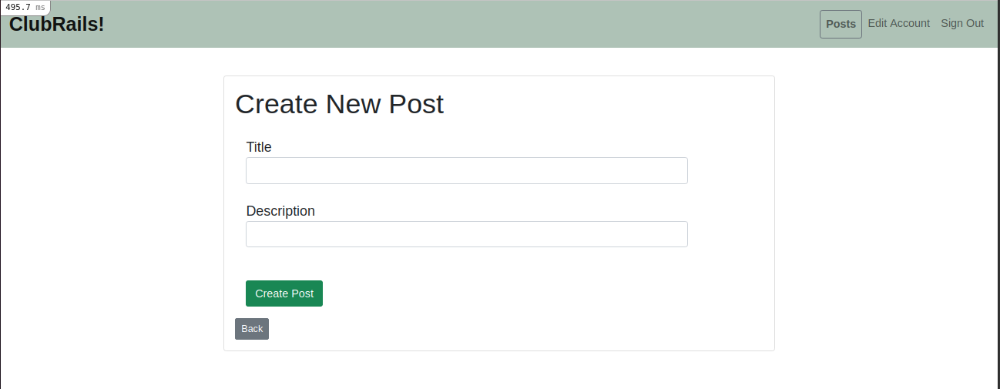
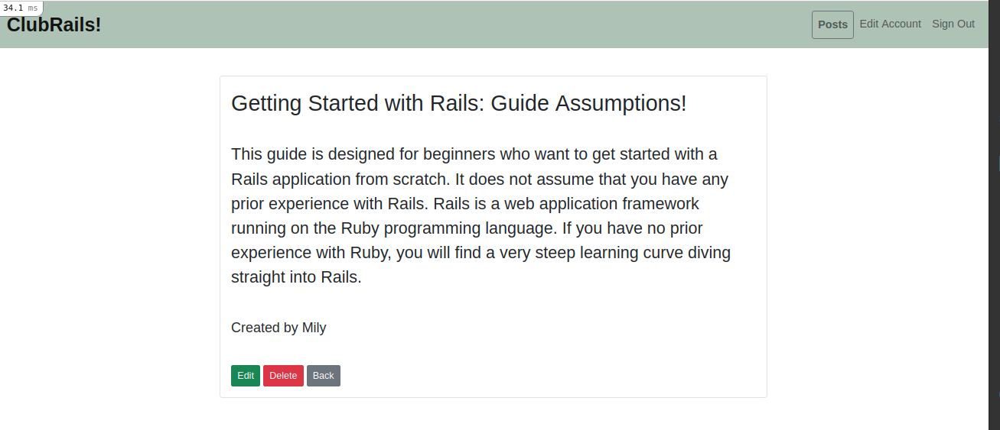

# Building an application using devise

> I created a Ruby on Rails application for a site where users can create accounts and posts.

- Consists of two models: user and post, two controllers: home and posts, two main views: home and posts.
- User authentication was built using the devise gem.
- A user can see the posts view, but need to be signed in to be able to see the post's author name.
- A user must be logged in to be able to edit or delete her/his posts.
- A user can edit her/his account information, and delete her/his account.
- Works on the browser.

## Built With
- Ruby (v. 2.6.5)
- Ruby on Rails (v. 6.1.1)
- devise gem
- Bootstrap
- Rubocop
- Git
 
## Setup
- Run 'bundle install'
 
## How to run it
* It's recommended to use Git's latest version.
* Clone or download the repo from here [members-only](https://github.com/Milypm/members-only.git) on your local system.
  - Click on the "Code" green button and copy HTTPS URL.
  - Go to your local system, on an empty folder, to clone the repo: 'git clone -HTTPS URL-'.
  - Go to the root directory.
  - Install the dependencies: 'bundle install'.
  - Migrate the database: 'rails db:migrate'.
  - Start the server: 'rails server' or 'rails s'.
  - Copy/open the path given to open the project in the browser: 'http://localhost:3000/'.
 
## Author
**Mily Puente** :woman_technologist:
- GitHub: [@Milypm](https://github.com/Milypm)
- LinkedIn: [Mily Puente](https://www.linkedin.com/in/milypuentem/)
 
## Contribute :point_left:
Any advice and suggestion for improvement are more than welcome.
Visit [issues' section](https://github.com/Milypm/members-only/issues)

## Show your support
Give a :star2: if you like this project!

## License

This project is <a href="../feature/LICENSE">MIT</a> licensed.

